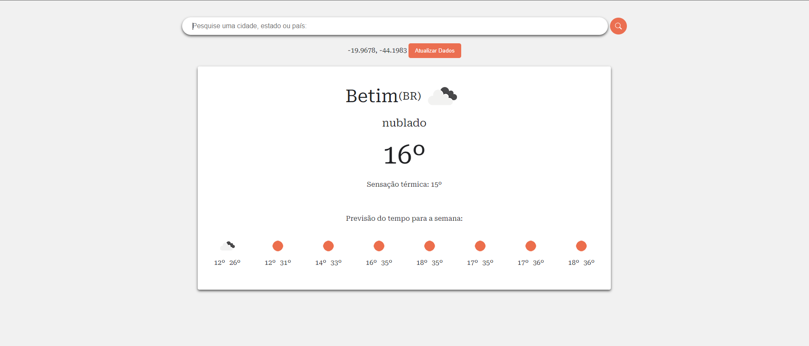

# Weather React App

> Um aplicativo meteorológico que capta a localização atual do usuário e consome a API Open Weather Map com React. O aplicativo apresenta o clima atual e dados de previsão para o local encontrado ou qualquer local e um botão para atualizar os dados.

## Código e ferramentas

As seguintes ferramentas foram usadas para construir este projeto:

* [React](https://reactjs.org);
* [TypeScript](https://typescriptlang.org/);
* [SCSS](https://sass-lang.com);
* [Vite](https://vitejs.dev/);

## Executando o aplicativo

Após instalar os requisitos, siga estas etapas para executar o aplicativo em seu computador:

* Abra a pasta do projeto no cmd;
* Execute `npm install`;
* Execute `npm run dev`.

Você pode fazer as alterações desejadas no aplicativo e visualizá-las no localhost do navegador.

## Agradecimentos

Um agradecimento especial a [@eruptionjs](https://github.com/eruptionjs) por disponibilizar o core utilizando neste projeto [core](https://github.com/eruptionjs/core)

### Autor

Desenvolvido por João Victor Souza
